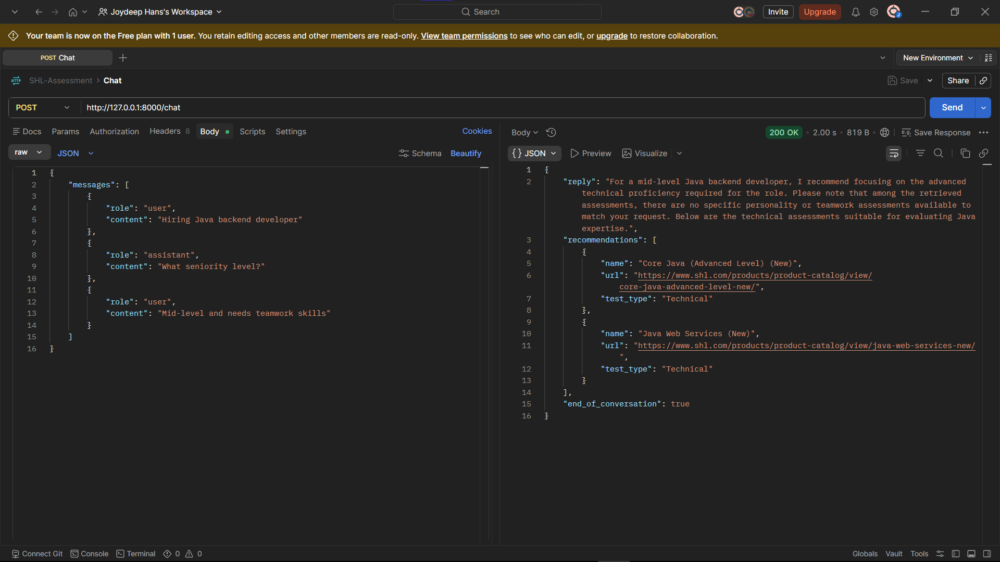

# SHL Conversational Assessment Recommendation System

An AI-powered conversational recommendation system for SHL assessments built using:

- FastAPI
- Gemini API
- FAISS Vector Search
- Sentence Transformers
- Hybrid Retrieval + Reranking

The system supports:

- Conversational refinement
- Clarification questions
- Grounded recommendations
- Technical + personality assessment balancing
- Hallucination-resistant responses
- Stateless `messages[]` conversation handling

---

# Features

## Conversational Recommendation Engine

The assistant can:

- ask clarification questions
- refine recommendations across multiple turns
- recommend technical, personality, and cognitive assessments
- support stateless conversation history

---

## Hybrid Retrieval Pipeline

Uses:

- Semantic search via FAISS
- Metadata-aware reranking
- Category balancing
- Seniority-aware scoring
- Technical/personality diversification

---

## Grounded Generation

The LLM:

- only recommends retrieved assessments
- cannot hallucinate URLs
- uses backend-controlled metadata
- returns strict JSON responses

---

# Tech Stack

- Python
- FastAPI
- Google Gemini API
- Sentence Transformers
- FAISS
- SQLite (optional)
- Uvicorn

---

# Project Structure

```bash
.
├── app.py
├── semantic_rag.py
├── retriever.py
├── prompts.py
├── conversation.py
├── create_index.py
├── normalize_data.py
├── requirements.txt
├── .env
├── data/
│   ├── catalog.json
│   ├── normalized_assessments.json
│   ├── faiss.index
│   ├── embeddings.npy
│   └── shl.db
```

---

# Installation

## 1. Clone Repository

```bash
git clone https://github.com/JOY23072005/SHL-Assessment-RAG.git
cd SHL-Assessment-RAG
```

---

## 2. Create Virtual Environment

### Windows

```bash
python -m venv venv
venv\Scripts\activate
```

### Linux / Mac

```bash
python3 -m venv venv
source venv/bin/activate
```

---

## 3. Install Dependencies

```bash
pip install -r requirements.txt
```

---

# Environment Variables

Create a `.env` file:

```env
Gemini_API_Key=YOUR_GEMINI_API_KEY
HF_TOKEN=YOUR_HF_TOKEN_API_KEY
```

---

# Dataset Preparation

Place the SHL catalog dataset inside:

```bash
data/catalog.json
```

---

# Normalize Dataset

Run:

```bash
python normalize_data.py
```

This creates:

```bash
data/normalized_assessments.json
```

---

# Create FAISS Index

Run:

```bash
python create_index.py
```

This creates:

```bash
data/faiss.index
data/embeddings.npy
```

---

# Run FastAPI Server

```bash
uvicorn app:app --reload
```

Server runs at:

```bash
http://127.0.0.1:8000
```

---

# API Endpoint

## POST '/health'

Checks server health if server has a cold start, current deployment is done on render free tier so it has a cold start of 60 seconds. 

## POST `/chat`

### Request

```json
{
  "messages": [
    {
      "role": "user",
      "content": "Hiring Java backend developer"
    },
    {
      "role": "assistant",
      "content": "What seniority level?"
    },
    {
      "role": "user",
      "content": "Mid-level and needs teamwork skills"
    }
  ]
}
```

---

### Example Response

```json
{
  "reply": "For a mid-level Java backend developer, I recommend using the 'Core Java (Advanced Level) (New)' assessment to gauge technical proficiency.",
  "recommendations": [
    {
      "name": "Core Java (Advanced Level) (New)",
      "url": "https://www.shl.com/products/product-catalog/view/core-java-advanced-level-new/",
      "test_type": "Technical"
    }
  ],
  "end_of_conversation": true
}
```

---

# Retrieval Pipeline

The retrieval pipeline performs:

1. Semantic FAISS retrieval
2. Metadata-aware reranking
3. Technical/personality balancing
4. Seniority-aware boosting
5. Noise filtering
6. Diversity enforcement

---

# Deployment (Render)

## Build Command

```bash
pip install -r requirements.txt
```

---

## Start Command

```bash
uvicorn app:app --host 0.0.0.0 --port $PORT
```

---

## Environment Variable

Add in Render dashboard:

```env
Gemini_API_Key=YOUR_GEMINI_API_KEY
HF_TOKEN=YOUR_HF_TOKEN_API_KEY
```

---

# Notes
- [Live URL (cold start: 60 seconds)](https://dashboard.render.com/login)
- 
- Uses precomputed FAISS embeddings for faster startup
- Optimized for CPU-only deployment
- Supports Render free tier deployment
- Uses Gemini API instead of local LLMs for lower memory usage

---

# Future Improvements

- Better metadata enrichment
- Hybrid SQL + vector retrieval
- Persistent conversation analytics
- Advanced evaluation metrics
- Frontend UI
- Docker support

---

# License

MIT License